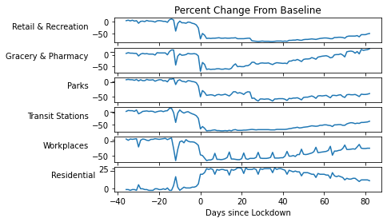

Assignment: Exploratory data analysis
=====================================

**TODO**: Edit this cell to fill in your NYU Net ID and your name:

-   **Net ID**: as14229
-   **Name**: Anant Singh

Introduction
------------

In this assignment, we will practice using exploratory data analysis on
Google’s COVID-19 Community Mobility data.

This data was collected from Google Maps users around the world over the
last few months - including you, *if* you have Google Maps on your phone
and have turned on the Location History setting. It combines location
history from a large number of users to capture the overall increase or
decrease in time spent in places such as: retail and recreation
facilities, groceries and pharmacies, parks, transit stations,
workplaces, and residences.

As you work through this notebook, you will see that some text and code
cells are marked with a “TODO” at the top. You’ll have to edit these
cells to fill in the code or answer the questions as indicated.

Learn about the data
--------------------

First, it is worthwhile to learn more about the data: how it is
collected, what is included, how Google gets consent to collect this
data, and how user privacy is protected. Google provides several
resources for learning about the data:

-   [Blog
    post](https://www.blog.google/technology/health/covid-19-community-mobility-reports?hl=en)
-   [About this
    data](https://www.google.com/covid19/mobility/data_documentation.html?hl=en#about-this-data)
-   [Understand the
    data](https://support.google.com/covid19-mobility/answer/9825414?hl=en&ref_topic=9822927)

Read in data
------------

Now you are ready to read the data into your notebook.

Visit Google’s web page for the [COVID-19 Community
Mobility](https://www.google.com/covid19/mobility/) project to get the
URL for the data.

(Specific instructions will depend on your browser and operating system,
but on my laptop, I can get the URL by right-clicking on the button that
says “Download global CSV” and choosing “Copy Link Address”.)

Then, in the following cells, use that URL to read the data into a
pandas Data Frame called `df`. (You can follow the example in the
“Exploratory data analysis” notebook from this week’s lesson.)


```python
import pandas as pd
import seaborn as sns
import matplotlib.pyplot as plt
```

    /usr/local/lib/python3.6/dist-packages/statsmodels/tools/_testing.py:19: FutureWarning: pandas.util.testing is deprecated. Use the functions in the public API at pandas.testing instead.
      import pandas.util.testing as tm
    


```python
# TODO Q1
url = 'https://www.gstatic.com/covid19/mobility/Global_Mobility_Report.csv?cachebust=694ae9957380f150'
df = pd.read_csv(url)
```

    /usr/local/lib/python3.6/dist-packages/IPython/core/interactiveshell.py:2718: DtypeWarning: Columns (3) have mixed types.Specify dtype option on import or set low_memory=False.
      interactivity=interactivity, compiler=compiler, result=result)
    

Use the `info()` and `head()` functions to show some basic information
about the data and to look at the first few samples.


```python
# TODO Q2
df.info()
```

    <class 'pandas.core.frame.DataFrame'>
    RangeIndex: 540126 entries, 0 to 540125
    Data columns (total 13 columns):
     #   Column                                              Non-Null Count   Dtype  
    ---  ------                                              --------------   -----  
     0   country_region_code                                 539194 non-null  object 
     1   country_region                                      540126 non-null  object 
     2   sub_region_1                                        524061 non-null  object 
     3   sub_region_2                                        312427 non-null  object 
     4   iso_3166_2_code                                     195608 non-null  object 
     5   census_fips_code                                    312546 non-null  float64
     6   date                                                540126 non-null  object 
     7   retail_and_recreation_percent_change_from_baseline  416716 non-null  float64
     8   grocery_and_pharmacy_percent_change_from_baseline   400447 non-null  float64
     9   parks_percent_change_from_baseline                  248195 non-null  float64
     10  transit_stations_percent_change_from_baseline       287509 non-null  float64
     11  workplaces_percent_change_from_baseline             526546 non-null  float64
     12  residential_percent_change_from_baseline            298340 non-null  float64
    dtypes: float64(7), object(6)
    memory usage: 53.6+ MB
    


```python
# TODO Q3
df.head()
```


<div>
<style scoped>
    .dataframe tbody tr th:only-of-type {
        vertical-align: middle;
    }

    .dataframe tbody tr th {
        vertical-align: top;
    }

    .dataframe thead th {
        text-align: right;
    }
</style>
<table border="1" class="dataframe">
  <thead>
    <tr style="text-align: right;">
      <th></th>
      <th>country_region_code</th>
      <th>country_region</th>
      <th>sub_region_1</th>
      <th>sub_region_2</th>
      <th>iso_3166_2_code</th>
      <th>census_fips_code</th>
      <th>date</th>
      <th>retail_and_recreation_percent_change_from_baseline</th>
      <th>grocery_and_pharmacy_percent_change_from_baseline</th>
      <th>parks_percent_change_from_baseline</th>
      <th>transit_stations_percent_change_from_baseline</th>
      <th>workplaces_percent_change_from_baseline</th>
      <th>residential_percent_change_from_baseline</th>
    </tr>
  </thead>
  <tbody>
    <tr>
      <th>0</th>
      <td>AE</td>
      <td>United Arab Emirates</td>
      <td>NaN</td>
      <td>NaN</td>
      <td>NaN</td>
      <td>NaN</td>
      <td>2020-02-15</td>
      <td>0.0</td>
      <td>4.0</td>
      <td>5.0</td>
      <td>0.0</td>
      <td>2.0</td>
      <td>1.0</td>
    </tr>
    <tr>
      <th>1</th>
      <td>AE</td>
      <td>United Arab Emirates</td>
      <td>NaN</td>
      <td>NaN</td>
      <td>NaN</td>
      <td>NaN</td>
      <td>2020-02-16</td>
      <td>1.0</td>
      <td>4.0</td>
      <td>4.0</td>
      <td>1.0</td>
      <td>2.0</td>
      <td>1.0</td>
    </tr>
    <tr>
      <th>2</th>
      <td>AE</td>
      <td>United Arab Emirates</td>
      <td>NaN</td>
      <td>NaN</td>
      <td>NaN</td>
      <td>NaN</td>
      <td>2020-02-17</td>
      <td>-1.0</td>
      <td>1.0</td>
      <td>5.0</td>
      <td>1.0</td>
      <td>2.0</td>
      <td>1.0</td>
    </tr>
    <tr>
      <th>3</th>
      <td>AE</td>
      <td>United Arab Emirates</td>
      <td>NaN</td>
      <td>NaN</td>
      <td>NaN</td>
      <td>NaN</td>
      <td>2020-02-18</td>
      <td>-2.0</td>
      <td>1.0</td>
      <td>5.0</td>
      <td>0.0</td>
      <td>2.0</td>
      <td>1.0</td>
    </tr>
    <tr>
      <th>4</th>
      <td>AE</td>
      <td>United Arab Emirates</td>
      <td>NaN</td>
      <td>NaN</td>
      <td>NaN</td>
      <td>NaN</td>
      <td>2020-02-19</td>
      <td>-2.0</td>
      <td>0.0</td>
      <td>4.0</td>
      <td>-1.0</td>
      <td>2.0</td>
      <td>1.0</td>
    </tr>
  </tbody>
</table>
</div>


Basic data manipulations
------------------------

The data includes a date field, but it may have been read in as a
string, rather than as a `datetime`. If that’s the case, use
`to_datetime()` to convert the field into a datetime format. (You can
follow the example in the “Exploratory data analysis” notebook from this
week’s lesson.)

Then, use `info()` again to make sure your change was applied. Note the
difference in the output, relative to the cell above.


```python
# TODO Q4
df['date'] = pd.to_datetime(df['date'])
```

Next, you are going to extract the subset of data for the location of
your choice. You can choose any location *except* Brooklyn, New York.
(You can’t choose Brooklyn because the example code I’m about to show
you is for Brooklyn.)

The data is reported for different regions, with different levels of
granularity available. This is best explained by example:

Suppose I want the overall trend from the entire U.S. I would use the
subset of data where `country_region` is equal to “United States” and
`sub_region_1` is null:

    df_subset = df[(df['country_region'].eq("United States")) & (df['sub_region_1'].isnull())]

Suppose I want the overall trend from the entire state of New York: I
would use the subset of data where `country_region` is equal to “United
States”, `sub_region_1` is equal to “New York”, and `sub_region_2` is
null:

    df_subset = df[(df['country_region'].eq("United States")) & (df['sub_region_1'].eq("New York")) & (df['sub_region_2'].isnull())]

Suppose I want the overall trend from Brooklyn, New York (Kings County):
I would use the subset of data where `country_region` is equal to
“United States”, `sub_region_1` is equal to “New York”, and
`sub_region_2` is equal to “Kings County”:

    df_subset = df[(df['country_region'].eq("United States")) & (df['sub_region_1'].eq("New York")) & (df['sub_region_2'].eq("Kings County"))]

In the following cell(s), fill in the code to create a data frame
`df_subset` with data from a single location. You can go down to the
`sub_region_1` level or the `sub_region_2` level - depending on the
location you chose, the finer level of granularity may not be available.


```python
# TODO Q5
df_subset = df[(df['country_region'].eq("India")) & (df['sub_region_1'].eq("Uttar Pradesh"))]
```

Is the data complete, or is some data not available for the location you
have chosen? In the following cell, write code to check for missing data
in the `...percent_change_from_baseline` fields.


```python
# TODO Q6
df_subset[['retail_and_recreation_percent_change_from_baseline', 
           'grocery_and_pharmacy_percent_change_from_baseline', 
           'parks_percent_change_from_baseline',
           'transit_stations_percent_change_from_baseline',
           'workplaces_percent_change_from_baseline',
           'residential_percent_change_from_baseline']].isnull().sum()
```


    retail_and_recreation_percent_change_from_baseline    0
    grocery_and_pharmacy_percent_change_from_baseline     0
    parks_percent_change_from_baseline                    0
    transit_stations_percent_change_from_baseline         0
    workplaces_percent_change_from_baseline               0
    residential_percent_change_from_baseline              0
    dtype: int64


**TODO** Q7: Edit this cell to answer the following question: Is the
data complete, or is some relevant data missing? Why would some
locations only have partial data available (missing some
`...percent_change_from_baseline` fields for some dates)? **Include a
short quote from the material you read in the “Learn about the data”
section to answer this question.**

Answer 7: For the loaction I have chosen the data is complete, although I understood that if data is missing for some location then it is intentionally done by google to protect user privacy as stated in description on google's website -

"*These gaps are intentional and happen because the data doesn’t meet the quality and privacy threshold—when there isn’t enough data to ensure anonymity*"

But there is no granularity in sub_region_2 for my location.

For this data, the `date` field is important, but we don’t necessarily
care about the absolute date. Instead, we care about how many days have
elapsed since the first confirmed case of COVID-19 in this location, how
many days have elapsed since a “stay at home” order or similar rule was
established in this location (if there was one) and how many days have
elapsed since it was lifted (if applicable).

For example, in Brooklyn, New York, I might compute:

    days_since_lockdown = (df_ny_all['date'] - pd.to_datetime('2020-03-20 00:00:00')).dt.days.values
    # NYC lockdown March 20, 2020 https://www.nytimes.com/2020/03/20/us/coronavirus-today.html

Compute “days since \[some relevant COVID-19 date\]” for your location.
In a comment, explain the significance of the date you have chosen, and
include a link to a news article or other reference supporting the
significance of the date. (The news article does not have to be in
English.)


```python
# TODO Q8
days_since_lockdown = (df_subset['date'] - pd.to_datetime('2020-03-22 00:00:00')).dt.days.values
```

Visualize data
--------------

Finally, we are going to visualize the changes in human mobility over
this time.

In the following cell, create a figure with six subplots, arranged
vertically. (You can refer to the example in the “Python + numpy”
notebook from this week’s lesson.) On the horizontal axis, put the
`days_since...` array you computed in the previous cell. On the vertical
axes, show:

-   `retail_and_recreation_percent_change_from_baseline` in the top
    subplot
-   `grocery_and_pharmacy_percent_change_from_baseline` in the next
    subplot
-   `parks_percent_change_from_baseline` in the next subplot
-   `transit_stations_percent_change_from_baseline` in the next subplot
-   `workplaces_percent_change_from_baseline` in the next subplot
-   `residential_percent_change_from_baseline` in the bottom subplot


```python
# TODO Q9
import matplotlib.pyplot as plt
%matplotlib inline


plt.subplot(611)
plt.plot(days_since_lockdown,df_subset['retail_and_recreation_percent_change_from_baseline'])
plt.ylabel('Retail & Recreation',rotation =0,horizontalalignment='right')

plt.title('Percent Change From Baseline')

plt.subplot(612)
plt.plot(days_since_lockdown,df_subset['grocery_and_pharmacy_percent_change_from_baseline'])
plt.ylabel('Gracery & Pharmacy',rotation =0,horizontalalignment='right')

plt.subplot(613)
plt.plot(days_since_lockdown,df_subset['parks_percent_change_from_baseline'])
plt.ylabel('Parks',rotation =0,horizontalalignment='right')

plt.subplot(614)
plt.plot(days_since_lockdown,df_subset['transit_stations_percent_change_from_baseline'])
plt.ylabel('Transit Stations',rotation =0,horizontalalignment='right')

plt.subplot(615)
plt.plot(days_since_lockdown,df_subset['workplaces_percent_change_from_baseline'])
plt.ylabel('Workplaces',rotation =0,horizontalalignment='right')

plt.subplot(616)
plt.plot(days_since_lockdown,df_subset['residential_percent_change_from_baseline'])
plt.ylabel('Residential',rotation =0,horizontalalignment='right')

plt.xlabel('Days since Lockdown')
plt.show()
```





**TODO** Q10: Answer the following question: Do the results seem to
satisfy “common sense”? Explain, citing specific data from your plot to
support your answer.

Answer 10: Yes, the results seems to satisfy common sense, as soon as the lockdown was enforced on March 22 there is significant change in data which is very clearly visible. Also as the lockdown is easing up the data shows that everythng is comming back to normal slowly. Also data perfectly aligns with festival of Holi of March 10, and Republic day on Jan 26, one can observe decreased activity in workplaces and increased activity in Residential plots.


**TODO** Q11: In the [Calibrate
Region](https://support.google.com/covid19-mobility/checklist/9834261?hl=en&ref_topic=9822927)
checklist, Google suggests a number of reasons why the data might *not*
be useful for understanding the effect of COVID-19-related lockdowns, or
why the data might be misleading. For the location you have chosen,
briefly answer all of the questions in that checklist. Based on your
answers, do you think there are any serious problems associated with
using this data for understanding user mobility changes due to COVID-19?

A11: 

Calibration of data
1. Did anything significant happen between Jan 3 and Feb 6, 2020?
    
    A. Yes, there was public holidays on Jan 26.. Also there were  major  public holidays after Feb 6 and before Lockdown a and those have to be taken into account.
2. How do park visitors change from January to now?

    A. Park visitors generally increases in the area from January gradually as the winter fades away. Park records are not uploaded on internet yet.But historical data can be collected through RTI application in the related department.
3. How much more time do you think people will spend in residential 
places?

    A. Since lockdown except from essential services people are not stepping out, and that contributes to huge increase in hours at residential places. And I dont find need to adjust the data.
4. How might types of work affect the mobility changes on weekdays or weekends?
    
    A. Covid 19, surely did not affected all the jobs to the same extent, lockdown was not enforced on Government employees and essential workers in the same way as on general public. There was also issue with migrant workers here in India they did not follow lockdown stricty due to lack of basic amenities, but most of them do not have access to android smartphones and hence this dataset can't have affect of migrant workers on it.
5. How well is your region represented?

    A. My region is not adequatly represented, most of the land mass is rural area which is not represented well, but cities are represented well in general. Region contains very few workplaces that don’t allow mobile devices, but they too provide safe deposites at the workplace itself.

